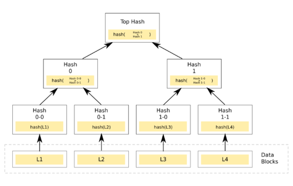
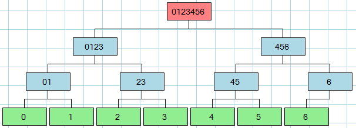
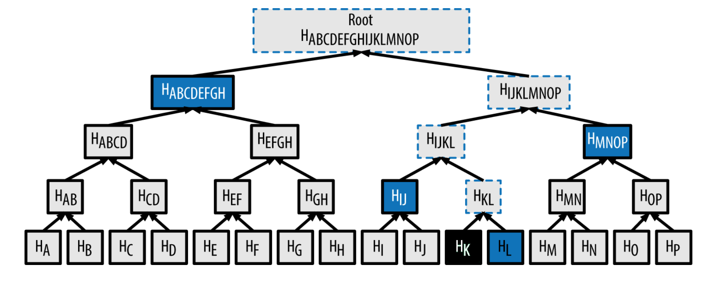

# Merkle Trees

A Merkle Tree is a binary data structure in which every leaf node contains the hashed (sha256 for example) values of the transaction data, and every branch node contains the hashed values of it's children.

Wildely used in cryptocurrency technology, Merkle Tree's allow proofing of data with O(n) lookup times.

In this example, there are 4 leaf nodes that contain hashed transaction values.

Since this is a binary tree, each branch node contains hashed values from the It's 2 children.

## Odd leaf count

In the above scneario, there are an odd amount of leaf nodes.

Instead of hashing the node twice, the odd node in the tree is simply moved above and hashed with the left pair's hash value.

## Verifying transactions

When using Merkle Trees, often times you want to verify transactions actually exist in the tree.

In the example above, we wish to verify transaction `HL` at index `11`.

To do this, you:

1. Find the position + hash value in the tree.

2. From there, you find the node's neighbor's hash value and hash them together.

3. You store this hash value for future comparison.

4. Repeat steps 1-3 until you reach the top of the tree.

Once climbing is complete, you compare the final hash value with the tree's root node. If they match, you have a valid transaction within your Merkle Tree.
